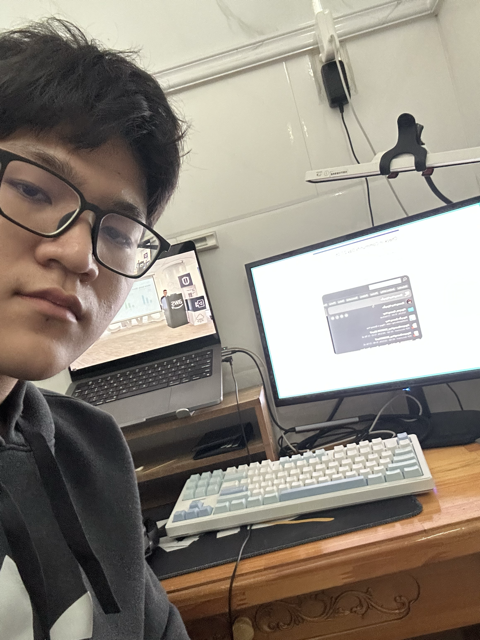

# Summary Report: "AWS FC Community Day"

### Event Objectives

- Share real-world experience, practical insights, and business perspectives on Cloud & AI.
- Update on pioneering technologies: Agentic Platform, Vietnamese Voice AI, AWS DevOps Agent, Amazon Q Business/Developer, and Private Security for MCP Server.
- Connect the community of engineers and experts, providing career path guidance for students and young engineers.

### Speakers

- **Steve Trần** - Founder @ Cloud Thinker (Former Solution Architect @ AWS)
- **Hiếu Nghị** - Cloud Engineer @ Renova Cloud
- **Anh Kiệt** - AWS Study Builder / Student AWS Cloud Club
- **Anh Trung** - Founder & CEO @ R AI (Former YC Founder)
- **Chị Bảo** - Cloud Engineer @ Cloud Kinetics
- **Anh Nguyên Nguyễn** - Cloud Engineer @ Cloud Kinetics
- **Anh Trường ** - AI Solution Architect @ Noventic
- **Chị Minh Anh** - Solution Specialist @ Noventic
- **Toàn Nguyễn** - AWS Security Builder

### Key Highlights

#### Session 1: Cloud Architecture & Agentic Platform for Infrastructure (Steve Trần - Cloud Thinker)

- **Career Path**: Sharing career development trajectory from Developer/DevOps to Solution Architect at AWS and tech startup Founder.
- **Solving Complexity & Tech Debt**: Applying AI Agents to support engineers in operating production-critical infrastructure (Incident investigation, IaC code review, FinOps/Cost Optimization, Security/Pen testing).
- **Single-Agent vs. Multi-Agent Architecture**: Analyzing the rationale behind choosing Multi-Agent (Specialist agents) to optimize LLM costs, reduce Context Window overhead, and support Role-Based Access Control (RBAC).

#### Session 2: Vietnamese Voice AI Agent & AWS Bedrock Demo (Hiếu Nghị, Anh Kiệt, Anh Trung)

- **Voice AI Architecture Comparison**: Analyzing trade-offs between Speech-to-Speech and the 3-step pipeline **STT → LLM (Tool Calling) → TTS** (suited for Vietnamese — a low-resource language, ensuring guardrails and real-time output control).
- **Real-world Operational Challenges**: Gender detection (appropriate honorifics), smart voice activity interruption (VAD/Context awareness), regional accent handling, and seamless Handoff to Human Agents.
- **Live Demo**: Voice Agent querying Apple/MacBook product information using AWS Bedrock Agent Core integrated with Knowledge Base.

#### Session 3: AWS DevOps AI Agent for Incident Management (Chị Bảo, Nguyên Nguyễn - Cloud Kinetics)

- **Overcoming Fragmented Telemetry**: Automating the Root Cause Analysis (RCA) workflow, significantly reducing MTTD and MTTR for large Microservices systems.
- **6 Core Pillars**: Context Learning (Topology mapping), Control (Least Privilege), Integration (MCP), Collaboration (Slack/Jira), Convenience, Cost-Effective.
- **4-Step Incident Workflow**: Trigger & Classification → Investigation (RCA) → Mitigation Plan (Human Approval) → Long-term Improvement.
- **Live Demo**: Simulating a DDoS attack on an E-commerce system running on ECS/ALB, where DevOps Agent isolates the root cause and provides direct mitigation commands.

#### Session 4: Amazon Q - AI Automation for Enterprise & HR (Anh Trường, Chị Minh Anh - Noventic)

- **Addressing HR Challenges**: Automating CV screening, eliminating biased evaluations, and ensuring enterprise data security compared to public AI models.
- **Data Connectivity**: Ingesting diverse data sources (SharePoint, Google Drive, S3, Jira, Databases...) via MCP Connectors with AWS-grade security & governance.
- **Skill Customization**: Building custom recruitment skills — analyzing CVs against JDs, calculating match percentages, estimating salary benchmarks, scheduling Outlook interviews, and generating HTML dashboard reports.

#### Session 5: Private Security Architecture for Amazon Q & MCP Server (Toàn Nguyễn, Hiếu Nghị)

- **Public Endpoint Security Risks**: Risks of DDoS attacks, Man-in-the-Middle (MitM) exploits, and data leakage when connecting MCP Servers over the Public Internet.
- **Private Security Architecture**: Deploying MCP Servers in Private Subnets, communicating securely via VPC Interface Endpoints, AWS Cognito Authentication, Application Load Balancers (TLS/SSL), and Route 53 Private Resolver.
- **Live Demo & Cost Estimation**: Querying real-time system metrics via Private MCP Server and assessing the infrastructure cost of security implementation.

### Key Takeaways

#### Architecture & Operations Mindset

- **Human-in-the-loop**: AI Agents act as productivity multipliers rather than replacing humans entirely in production-critical systems.
- **Resource Optimization**: Leveraging specialized Multi-Agent models to optimize token consumption, minimize context dilution, and enforce precise access control.

#### Voice AI & LLM Integration Techniques

- Understanding the mechanics of building Voice AI for low-resource languages like Vietnamese using an STT-LLM-TTS pipeline.
- Recognizing the critical role of Tool Calling, Guardrails, and context-aware interruption handling in real-time dialog systems.

#### Enterprise Security & Automation

- Applying Zero Trust security standards to MCP Servers using VPC Endpoints and Private DNS.
- Automating business workflows (DevOps, HR, FinOps) by securely connecting to internal enterprise data.

### Applying to Work

- **Pilot AWS DevOps Agent**: Establish automated log/trace analysis workflows for incident response in lab/project environments.
- **Build Custom Skills with Amazon Q**: Experiment with writing skill instruction files (.md) to automate document screening, requirements analysis, or report generation.
- **Implement Private VPC Architecture for MCP**: Ensure AI Agent integrations with internal systems comply with IAM Least Privilege and private networking principles.

### Event Experience

Attending the **AWS FC Community Day** was an exceptionally practical and valuable experience:

- **Learning from Field Experts**: Speakers from leading organizations (Cloud Thinker, Renova Cloud, R AI, Cloud Kinetics, Noventic) delivered realistic insights on operations and business challenges.
- **Impressionable Live Demos**: Watching live demos of Vietnamese Voice Agents, DDoS incident handling with DevOps Agent, and automated CV screening with Amazon Q provided clear visualization of real-world applicability.
- **Balanced Technical & Business Insights**: The event covered a comprehensive spectrum from deep infrastructure (Private VPC, Multi-Agent) to enterprise business applications (HR Automation, Cost Optimization).

#### Event Photos

